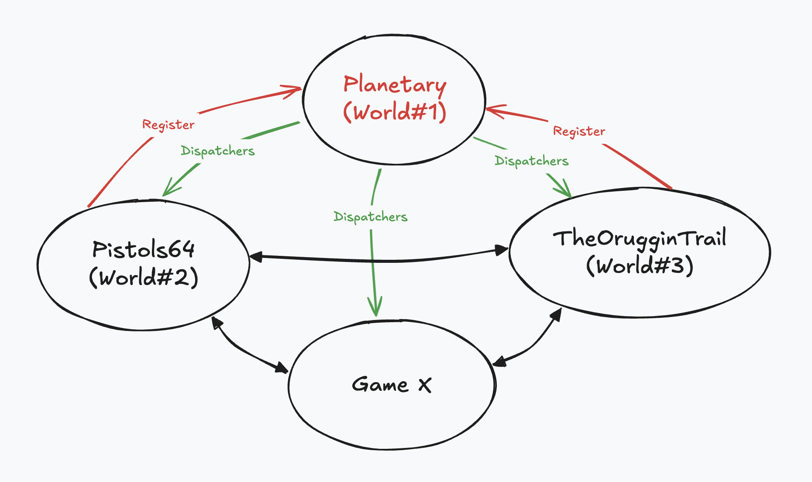

# 🔫 pistols-64

For the **Dojo Game Jam @ Dojo Sensei Residency NYC 2024**

## Team

* [Roger Mataleone](https://github.com/rsodre) / [@matalecode](https://x.com/matalecode)
* [Tim Storey](https://github.com/lbdl) / [@itrainspiders](https://x.com/itrainspiders)
* Calcutator

## Contents

### Dojo Contracts

* `/dojo/planetary`: world catalogue
* `/dojo/planetary_interface`: interface for **planetary** (crate), imported by worlds to connect to each other
* `/dojo/pistols64`: mini-pistols game contracts

### Clients

* `/clients/sdk`: generated files from the `pistols64` contract (manifest, typescript, GraphQL)
* `/clients/terminal`: Python shell terminal client
* [TheOrugginTrail](https://github.com/ArchetypalTech/TheOrugginTrail-DoJo): text adventure client


## 🌎 The Planetary System 

**Planetary** is a Dojo world that connects other Dojo worlds.

> ⚠️ This is a proof of concept, not secure, not meant for production.

How does it work?

* Planetary is a Dojo world deployed on Katana/Slot/Starknet
* It provides the `planetary_interface` crate for world discovery.
* Worlds need to `register()` to Planetary to be discoverable, usually at `dojo_init()`.
* Any world can discover other worlds from the interface.
* Discoverable worlds need their interface to be included in the Planetary interface.

Things to do and consider for future developments:

* Some protection around who can register and unregister worlds. Adding the worlds class hashes to the interface and checking the caller class hash matches it.
* This is a simple system but may be over-complicated. Since discoverable worlds are white-listed, they could have their world address hard-coded.




## 🪐 Planetary integration

Import `planetary_interface ` in your Dojo project `Scarb.toml`:

```toml
[dependencies]
dojo = { git = "https://github.com/dojoengine/dojo", tag = "v1.0.0-alpha.7" }
planetary_interface = { git = "https://github.com/underware-gg/pistols-64", branch = "main" }
# planetary_interface = { path = "../planetary_interface" }
```


### To discover a world

There's a test planet called **Vulcan** included in the planetary system. When saluted with `live_long()`, it replies `and_prosper`.

Example accessing Vulcan from [pistols64](/dojo/pistols64/src/systems/action.cairo).

```rust
#[dojo::contract]
mod actions {
    use planetary_interface::interfaces::vulcan::{
        VulcanInterface, VulcanInterfaceTrait,
        IVulcanSaluteDispatcher, IVulcanSaluteDispatcherTrait,
    };
    
    // ...

    // test with sozo:
    // sozo call pistols64-actions live_long
    fn live_long(world: @IWorldDispatcher) -> felt252 {
        let vulcan: IVulcanSaluteDispatcher = VulcanInterfaceTrait::new().dispatcher();
        (vulcan.live_long())
    }
}

```


### To make your world discoverable

The system interface has to be included in `planetary_interface`.
Example: [vulcan interface](/dojo/planetary_interface/src/interfaces/vulcan.cairo)

Then register it from the system you want to expose:
Example: [vulcan system](/dojo/planetary_interface/src/systems/vulcan.cairo)

```rust
use starknet::{ContractAddress};

#[dojo::interface]
trait IVulcan {
    fn live_long(world: @IWorldDispatcher) -> felt252;
}

#[dojo::contract(namespace: "vulcan", nomapping: true)]
mod salute {
    use planetary_interface::interfaces::planetary::{
        PlanetaryInterface, PlanetaryInterfaceTrait,
        IPlanetaryActionsDispatcher, IPlanetaryActionsDispatcherTrait,
    };
    use planetary_interface::interfaces::vulcan::{
        VulcanInterface, VulcanInterfaceTrait,
    };
    use planetary_interface::utils::misc::{WORLD};

    fn dojo_init(ref world: IWorldDispatcher) {
        let planetary: PlanetaryInterface = PlanetaryInterfaceTrait::new();
        planetary.dispatcher().register(VulcanInterfaceTrait::NAMESPACE, world.contract_address);
    }

    #[abi(embed_v0)]
    impl IVulcanImpl of IVulcan<ContractState> {
        fn live_long(world: @IWorldDispatcher) -> felt252 {
            ('and_prosper')
        }
    }
}

```


## 🚀 Running locally

Install Dojo `1.0.0-alpha.7`, Scarb `2.7` and Cargo. See the [Dojo Book](https://book.dojoengine.org/getting-started/).

Stuff you might need...

```sh
brew install jq
brew install protobuf
cargo install toml-cli
```

Start up one [Katana](https://book.dojoengine.org/toolchain/katana) instance:

```sh
cd dojo/planetary
./run_katana
```

Migrate Planetary

```sh
cd dojo/planetary
./migrate
```

Migrate your game to the same Katana

```sh
cd dojo/pistols64
./migrate
```

Start up a [Torii](https://book.dojoengine.org/toolchain/torii) server **indexing your game world**. Planetary does not need to be indexed, as it's intended to be be interacted on-chain only.

```sh
cd dojo/pistols64
./run_torii
```


## 🐙 TheOrugginTrail Interop

This assumes that `planetary` and `pistols64` are deployed to the same katana as explained above.

```sh
git clone --depth 1 --branch dojo_game_jam https://github.com/ArchetypalTech/TheOrugginTrail-DoJo.git 
```

```sh
cd TheOrugginTrail-Dojo
./migrate
```
## Interop P64 -> TOT
You can send commands into `TheOrugginTrail` from `Pistols64` from the script below.

__eg__ To call `TheOrugginTrail` from `Pistols64` with the command `look around`

```sh
./cmd_shoggoth path_to_pistols64_Scarb.toml look around
```

Feel salty and want to start a fight? We got you.

```sh
./cmd_shoggoth path_to_pistols64_Scarb.toml fight the power
```

This command calls into `TheOrugginTrail` from `Pistols64` and starts a fight by calling back into `Pistols64` from `TheOrugginTrail`.

## Interop TOT -> P64

Assuming you are in the `TheOrugginTrail` directory, you can call `Pistols64` from `TheOrugginTrail` with the script below.

```sh
./start_fight
```
It wraps a command string "fight the man" which triggers the call from `TheOrugginTrail` world to the `Pistols64` world.


  
## 💾 Run the shell terminal client

See [clients/terminal/README.md](clients/terminal/README.md).
